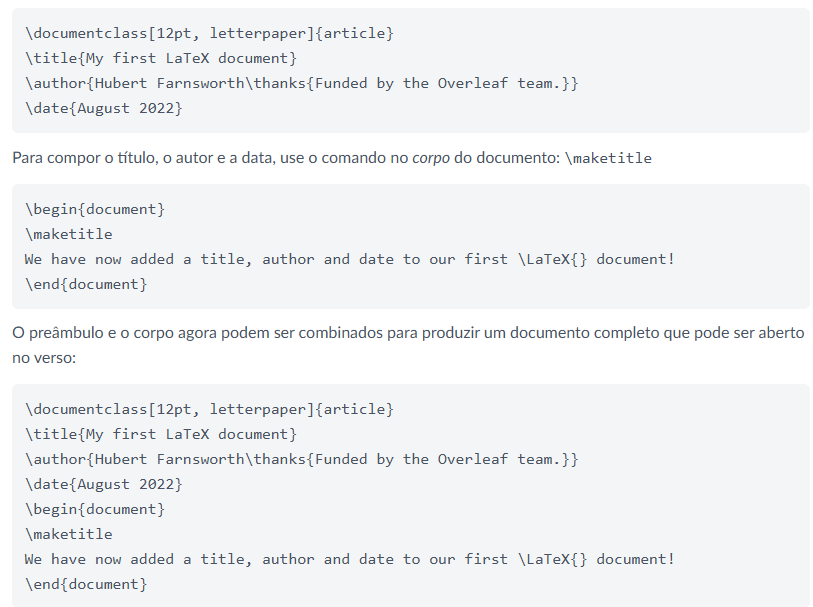
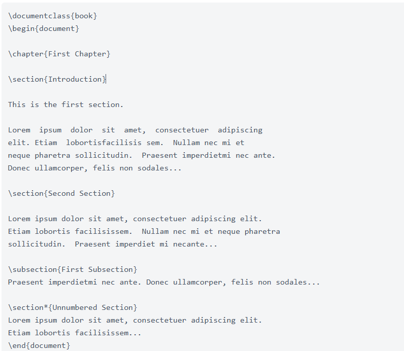
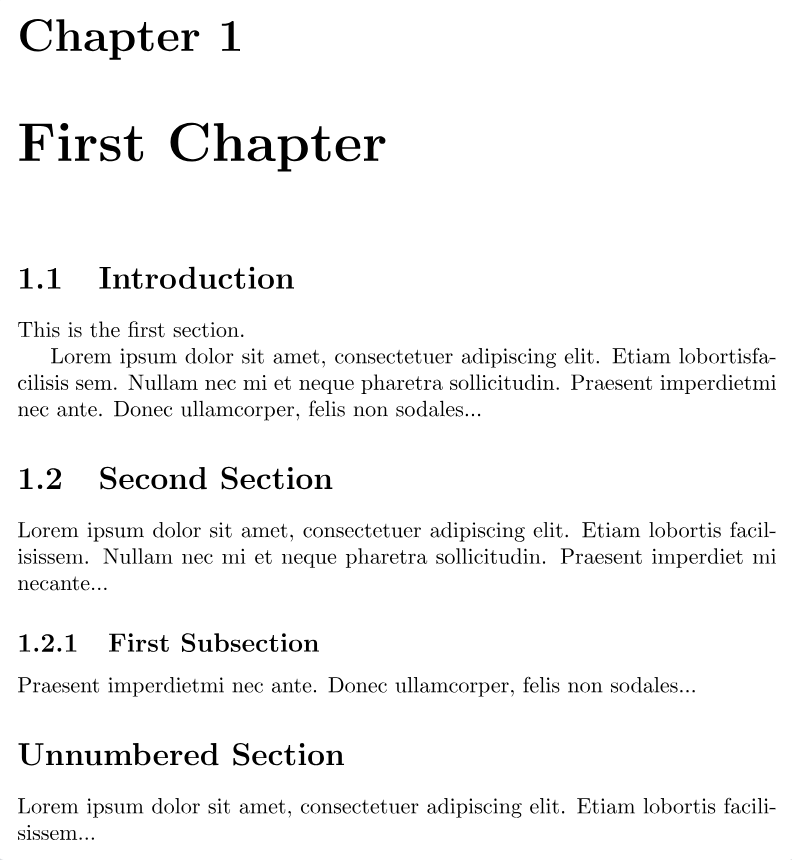
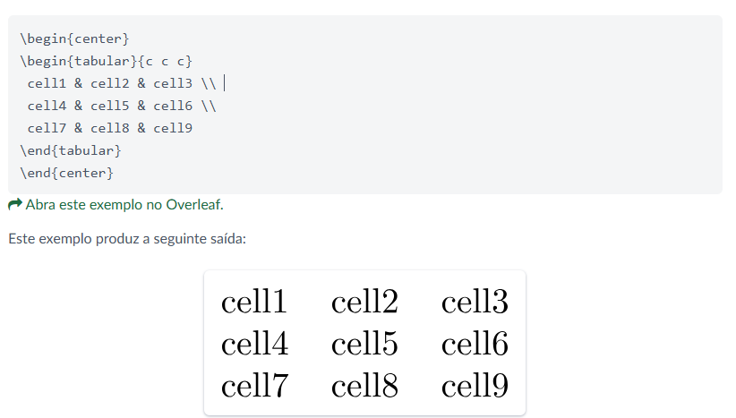
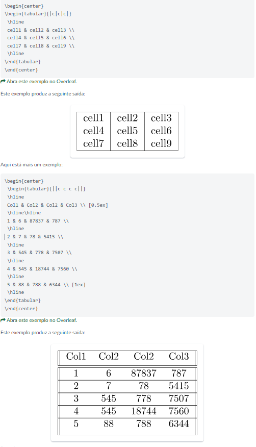
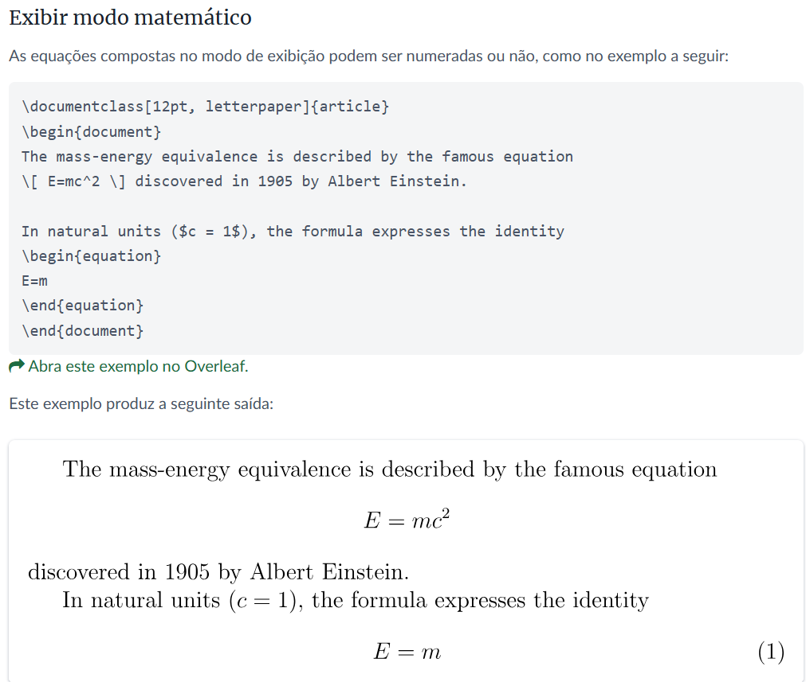
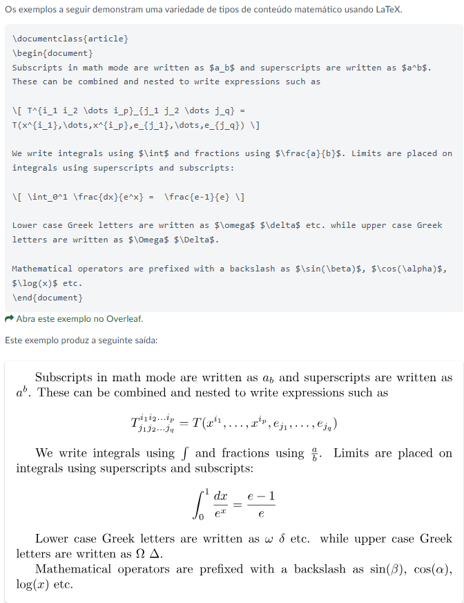
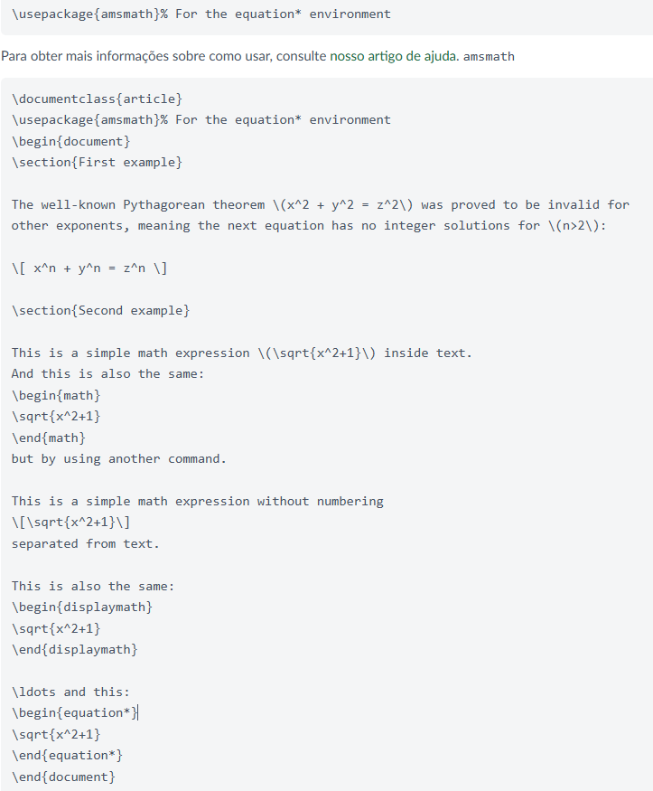
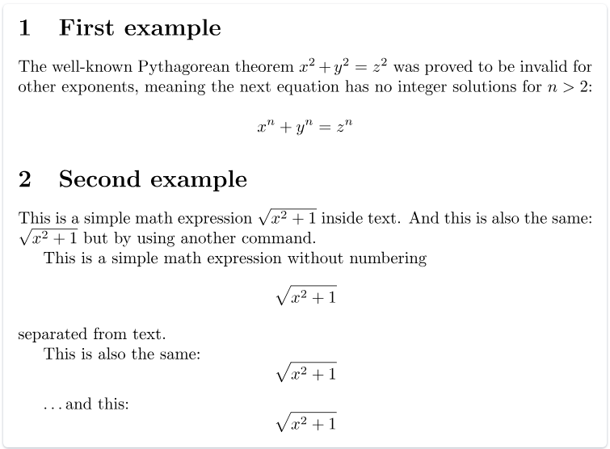

```{r setup, include=FALSE}
knitr::opts_chunk$set(echo = TRUE)
```

# - Objetivo:

Descrever sobre Markdon e Latex.

# - Markdown:

## - O que é o Markdown?
 
Markdown Syntax é uma sintaxe usada para padronizar e facilitar formatação de texto na web, utilizada em aplicativos como Slack e GitHub. Textos estilizados com Markdown são, na maioria dos casos, apenas texto com caracteres não-alfabéticos, como #, \* e , usados para a configuração de títulos, listas, itálico, negrito e inserção de imagens.
 
## - Como usar o Markdown para escrever uma documentação técnica?

Os artigos técnicos da Adobe são escritos em uma linguagem de marcação simples chamada Markdown, que facilita a leitura e o aprendizado.

Noções básicas sobre o Markdown

As seções a seguir descrevem as noções básicas de criação no Markdown.

Cabeçalhos

Para criar um cabeçalho, use uma marca de hash (#) no início de uma linha:

Observação: os hífens abaixo, não fazem parte do comando, foi usada somente para o comando não ser usado no sumário deste relatório 01. 

Como esconder o comentário acima após ele ser compilado?

- # This is level 1 (article title)
- ## This is level 2
- ### This is level 3
- #### This is level 4
- ##### This is level 5

Texto básico

Um parágrafo não requer sintaxe especial no Markdown.

Para formatar o texto como negrito, coloque-o entre dois asteriscos. Para formatar o texto como itálico, coloque-o entre um único asterisco:

   This text is **bold**.
   
   This text is *italic*.
   
   This text is both ***bold and italic***.
   

Para ignorar os caracteres de formatação do Markdown, use \ antes do caractere:

This is not \*italicized\* type.


Listas numeradas e listas de itens
Para criar listas numeradas, comece uma linha com 1. ou 1), mas não use ambos os formatos dentro da mesma lista. Você não precisa especificar os números. O GitHub faz isso para você.

1. This is step 1.

1. This is the next step.

1. This is yet another step, the third.


Para criar listas de itens, comece uma linha com * ou - ou +, mas não misture os formatos em uma mesma lista. (Não misture formatos de marcadores, como * e +, dentro do mesmo documento.)

* First item in an unordered list.
* Another item.
* Here we go again.

FONTE:

https://experienceleague.adobe.com/pt-br/docs/contributor/contributor-guide/writing-essentials/markdown#

## - Como inserir um link no Markdow?

Links
Existem duas formas de inserir link em Markdown, através de um link direto ou usando um texto-âncora:

Texto-âncora: utilize os caracteres [ ] e ( ), adicionando entre chaves o texto que você quer que apareça, e entre os parênteses, o endereço de destino, no formato [PHET](https://phet.colorado.edu/pt_BR/simulations/browse).

Link direto: envolva o endereço da web em chaves <>. O endereço ficará visível e será clicável pelo usuário. O endereço em forma de link direto tem o formato <https://phet.colorado.edu/pt_BR/simulations/browse>. 

## - Como fazer uma lista no Markdown?

Nesta etapas veremos um dos recursos do markdown estendido: como criar listas de tarefas, listas de verificação ou listas de tarefas pendentes."

Markdown é uma excelente linguagem de marcação para escrever documentos bem formatados e mínimos. O Markdown em si é uma linguagem de marcação leve desenvolvida por John Gruber e Aaron Swartz em 2004. Ele permite que você inclua marcação de formatação em texto simples e os processe em documentos HTML renderizados.
O Markdown é amplamente adotado em muitas áreas, incluindo geradores de sites estáticos, documentação de código, etc.


Lista de tarefas/caixa de seleção

Uma lista de tarefas ou caixa de seleção é uma formatação simples que permite que você crie uma lista de itens e inclua uma caixa de seleção. Você pode marcar esse valor como marcado ou desmarcado, dependendo do status do alvo.

Podemos criar caixas de seleção em markdown usando um traço, um espaço e um colchete. Tenha em mente que esse é um recurso estendido e dependerá do aplicativo Markdown.


A sintaxe abaixo mostra como criar uma caixa de seleção desmarcada no Markdown:

- []
Por exemplo:

- [ ] Oracle
- [ ] MySQL
- [ ] Microsoft SQL Server
- [ ] PostgreSQL
- [ ] Redis
- [ ] Elasticsearch
- [ ] SQLite
- [ ] MariaDB
- [ ] Solr
- [ ] Neo4j
- [ ] HBase
- [ ] Couchbase

O Markdown deve renderizar a saída conforme mostrado acima.


Você também pode criar uma caixa de seleção adicionando um x ao par de colchetes. A sintaxe é como mostrada:

- [x]
Por exemplo:

- [ ] Oracle
- [x] MySQL
- [x] Microsoft SQL Server
- [x] PostgreSQL
- [ ] Redis
- [ ] Elasticsearch
- [x] SQLite
- [x] MariaDB
- [ ] Solr
- [ ] Neo4j
- [ ] HBase
- [x] Couchbase

O código markdown deve retornar uma saída renderizada conforme mostrado acima.


E com isso, você tem uma maneira de criar caixas de seleção, listas de verificação ou listas de tarefas em Markdown.

Conclusão

Nesta etapa, exploramos como criar caixas de seleção no Markdown usando a sintaxe de hífen, espaço e colchetes.

FONTE:

https://linuxhint-com.translate.goog/markdown-checkbox/?_x_tr_sl=en&_x_tr_tl=pt&_x_tr_hl=pt-BR&_x_tr_pto=sc


## - Como fazer uma tabela no Markdown?

Você pode criar tabelas com pipes | e hífens -. Hifens: são usados para criar o cabeçalho de cada coluna, enquanto as barras verticais separam cada coluna. Você deve incluir uma linha em branco antes da tabela para ela ser construída corretamente.


| First Header  | Second Header |
| ------------- | ------------- |
| Content Cell  | Content Cell  |
| Content Cell  | Content Cell  |

TABELA 

Captura de tela de uma tabela Markdown com duas colunas de largura igual, conforme renderizada no GitHub. Os cabeçalhos são renderizados em negrito e as linhas de conteúdo alternativo têm sombreamento cinza.

As barras verticais em cada extremo da tabela são opcionais.

As células podem ter largura variada **e não precisam estar alinhadas perfeitamente com as colunas**. Deve ter no mínimo três hifens em cada coluna da linha do cabeçalho.

| Command | Description |
| --- | --- |
| git status | List all new or modified files |
| git diff | Show file differences that haven't been staged |

Captura de tela de uma tabela Markdown com duas colunas de largura diferente, conforme renderizada no GitHub. As linhas listam os comandos "git status" e "git diff" e as respectivas descrições.

Se você estiver editando tabelas e snippets de código com frequência, poderá se beneficiar da habilitação de uma fonte de largura fixa em todos os campos de comentário no GitHub. Para obter mais informações, confira "Sobre gravação e formatação no GitHub".

## - Como adicionar imagens e mídia no Markdown?

Comandos:  (interno a < > colocamos: img src = "logo") ou utilizamos o comando "Ponto de exclamação!, colchetes [figura 1 ] e (imagem)". 

Adicionando imagens

Para adicionar uma imagem a um documento, adicione seu arquivo de imagem à pasta do documento (neste exemplo nosso, esta na pasta rel01) e, em seguida, faça referência à imagem no arquivo index.md do documento usando os símbolos < > e internamente aos símbolos use: img src = ufsj.png. Ou a sintaxe Markdown equivalente (Ou seja, existem outras formas de inserir imagens no Markdown). 

Veja o exemplo a seguir:


FONTE:

https://developer.mozilla.org/pt-BR/docs/MDN/Writing_guidelines/Howto/Images_media

# - Latex

## - O que é Latex ? 

LaTeX é um sistema de preparação de documentos, uma versão especial do programa TeX de Donald Knuth. TeX é um sofisticado programa projetado para produzir um texto digitado de alta qualidade especialmente para caracteres matemáticos. LaTeX adicionado ao programa TeX é uma coleção de comandos que simplificam a digitação deixando que o usuário concentre-se mais na estrutura do documento do que na sua formatação.

Na verdade, LaTeX representa uma balança entre a funcionalidade e a facilidade de uso. Um bom exemplo disso é quando se escreve um documento longo onde tem-se que utilizar várias citações, referências cruzadas, numerações (capítulos, seções, subseções, figuras, tabelas, etc.). Se algo ocorre e tivermos que mudar uma numeração (acrescentando ou retirando partes do texto) todo o resto se complica. Teremos que mudar as numerações, as referências cruzadas, etc. Isto muitas vezes demanda um grande tempo nos processadores de texto "what you see is what you get" e está susceptível a erros incríveis. Assim o LaTeX é um tratador de textos e as mudanças podem ser feitas rapidamente.

FONTE:

https://www.inf.ufsc.br/~j.barreto/cca/tratexto/latex.htm

Para escrever o texto em Latex, você pode instalar o TexStudio no seu computador e usar esta versão até off line ou utilizar a versão on line do Latex, chamada Overleaf. Onde tudo é feito on line e de forma gratuita, sem precisar instalar qualquer programa. Aqui neste relatório vamos explorar o modo Overleaf, que não é muito distinta do Tex Studio.

Para começar a usar o Overleaf, vá para www.overleaf.com.
Se você não tiver uma conta, digite seu endereço de e-mail e defina uma senha nas caixas correspondentes abaixo Comece agora, clique em Registrar e pronto, você será redirecionado para a página de gerenciamento de projetos, onde será orientado sobre como criar um novo projeto.

## - Como iniciar um novo projeto?

Se você já possui uma conta, clique em Login no canto superior direito, digite seu e-mail e senha e clique no botão Login.	
Depois de fazer login, você deverá ver a página Gerenciamento de projetos no verso	
Iniciando um novo projeto
Para iniciar um novo projeto do zero, na página principal, clique no botão Novo Projeto, você verá o próximo menu suspenso	
e clique em Projeto em Branco. Uma caixa será aberta onde você deve inserir o nome do seu novo projeto e clicar em Criar.	
Depois disso, você será redirecionado para o editor.	
Lá, um novo documento é criado com algumas informações básicas já preenchidas. Você pode começar a editar seu arquivo .tex agora, para visualizar as alterações, clique em Recompilar. 
Outra opção para iniciar um novo projeto do zero é usar um Projeto de Exemplo. Na página Gerenciamento de projetos, clique no botão Novo projeto (primeira imagem nesta seção) e no menu suspenso clique em Projeto de exemplo, você verá uma caixa de texto onde deve inserir o nome do seu novo projeto (segunda imagem nesta seção), agora clique em Criar e você será redirecionado para o editor onde um documento de amostra será aberto.


## - O que é preâmbulo na escrita Latex?

O preâmbulo de um documento

 

A captura de tela acima mostra o Overleaf armazenando um documento LaTeX como um arquivo chamado : a extensão do arquivo é, por convenção, usada ao nomear arquivos contendo o código LaTeX do seu documento. 

O exemplo anterior mostrou como o conteúdo do documento foi inserido após o comando; No entanto, tudo em seu arquivo que aparece antes desse ponto é chamado de Preâmbulo, que atua como a seção "Configuração" do documento. No preâmbulo, você define a classe do documento (tipo) junto com especificidades, como idiomas a serem usados ao escrever o documento; carregando pacotes que você gostaria de usar (mais sobre isso mais tarde), e é onde você aplicaria outros tipos de configuração. \begin{document}.tex

Um preâmbulo mínimo de documento pode ter esta aparência:

 

documentclass[12pt, letterpaper]{article}

usepackage{graphicx}

Onde define a classe geral (tipo) do documento. Parâmetros adicionais, que devem ser separados por vírgulas, são incluídos entre colchetes () e usados para configurar essa instância da classe article; ou seja, configurações que desejamos usar para este documento baseado em classe específica.

documentclass[12pt, letterpaper]{article}[...]article

Neste exemplo, os dois parâmetros fazem o seguinte:

12pt: Define o tamanho da fonte

letterpaper: Define o tamanho do papel

É claro que outros tamanhos de fonte, podem ser usados, mas se nenhum for especificado, o tamanho padrão é 12pt . Quanto ao tamanho do papel, outros valores possíveis são e . Para obter mais informações, consulte o artigo sobre tamanho e margens da página. 

A linha do preâmbulo

usepackage{graphicx}

é um exemplo de carregamento de um pacote externo (aqui, graphicx) para estender os recursos de LaTeX, permitindo que ele importe arquivos gráficos externos. Os pacotes LaTeX são discutidos na seção Localizando e usando pacotes LaTeX.

Adicionar um título, autor e data ao nosso documento requer mais três linhas no preâmbulo (não o corpo principal do documento). Essas linhas são:

title{My first LaTeX document}: o título do documento, author{Hubert Farnsworth}: aqui você escreve o nome do(s) autor(es) e, opcionalmente, o comando dentro das chaves: thanks{Funded by the Overleaf team.}: 

Pode ser adicionado após o nome do autor, dentro das chaves do comando. Ele adicionará um sobrescrito e uma nota de rodapé com o texto dentro das chaves. Útil se você precisar agradecer a uma instituição em seu artigo.author

date{August 2022}: você pode inserir a data manualmente ou usar o comando para compor a data atual toda vez que o documento for compilado today.

Todos os comandos anteriores:

documentclass,
title,
author,
date,
begin,
maketitle,
usepackage,
latex,
thanks,
today e
end. São antecedidos por barra, como na imagem acima.

## - Como inserir Capítulos, seção e subseção em Latex?

Capítulos, seções e subseções:

Documentos mais longos, independentemente do software de autoria, geralmente são particionados em partes, capítulos, seções, subseções e assim por diante. O LaTeX também fornece comandos de estruturação de documentos, mas os comandos disponíveis e suas implementações (o que eles fazem) podem depender da classe de documento que está sendo usada. A título de exemplo, os documentos criados usando a classe podem ser divididos em partes, capítulos, seções, subseções e assim por diante, mas a classe não fornece (suporta) nenhum comando para fazer isso. 

O próximo exemplo demonstra os comandos usados para estruturar um documento com base na classe: book

 

Este exemplo produz a seguinte saída:

 

## - Como criar tabelas no Latex?

Os exemplos a seguir mostram como criar tabelas no LaTeX, incluindo a adição de linhas (regras) e legendas.

Criando uma tabela básica em LaTeX
Começamos com um exemplo mostrando como compor uma tabela básica:

 


O ambiente é o método padrão LaTeX para criar tabelas. Você deve especificar um parâmetro para este ambiente, neste caso que avisa LaTeX que haverá três colunas e o texto dentro de cada uma deve ser centralizado. Você também pode usar para alinhar o texto à direita e à esquerda. O símbolo de alinhamento é usado para demarcar células individuais da tabela dentro de uma linha da tabela. Para encerrar uma linha da tabela, use o comando new line . Nossa tabela está contida em um ambiente para torná-la centralizada na largura do texto da página. tabular{c c c} & \\center

Adicionando bordas
O ambiente dá suporte a linhas horizontais e verticais (regras) como parte da tabela: tabular

Para adicionar regras horizontais, acima e abaixo das linhas, use o comando barra hline.
Para adicionar regras verticais, entre colunas, use o parâmetro de linha vertical |
Neste exemplo, o argumento é que declara três colunas (centralizadas), cada uma separada por uma linha vertical (regra); Além disso, usamos para colocar uma régua horizontal acima da primeira linha e abaixo da linha final: {|c|c|c|} barra hline:

 

## - Adicionando matemática a LaTeX

Uma das principais vantagens de LaTeX é a facilidade com que as expressões matemáticas podem ser escritas. LaTeX fornece dois modos de escrita para composição matemática:

Modo matemático embutido usado para escrever fórmulas que fazem parte de um parágrafo
Modo matemático de exibição usado para escrever expressões que não fazem parte de um texto ou parágrafo e são compostas em linhas separadas
Modo matemático embutido

Vejamos um exemplo de modo matemático exibição:

 

 

O próximo exemplo usa o ambiente que é fornecido pelo pacote, portanto, precisamos adicionar a seguinte linha ao nosso preâmbulo do documento: equation*amsmath.

 

Este exemplo produz a seguinte saída:


 


FONTE:

https://pt.overleaf.com/learn/latex/Learn_LaTeX_in_30_minutes#Display_math_mode


# - Conclusão:

Apresentamos neste relatório, duas ferramentas poderosíssimas, Markdown e Latex, para edição de textos. Que comportam imagens, links, figuras, tabelas, fórmulas matemáticas, ... Que acreditamos ser essenciais para serem utilizadas no seu texto científico. Mais informações, consulte as fontes indicadas no texto.


