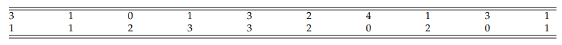
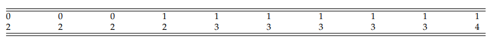
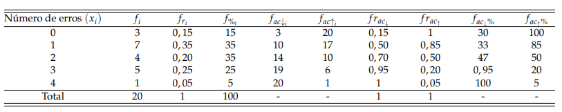
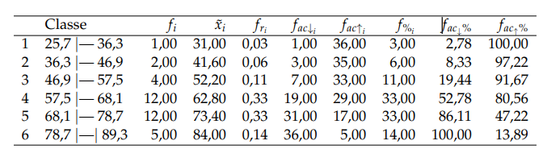
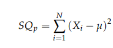
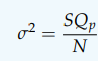
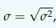

```{r setup, include=FALSE}
knitr::opts_chunk$set(echo = TRUE)
```

# - Objetivo:

Descrever sobre Estatística Descritiva.

Diante do objetivo do relatório, apresentaremos nas próximas subseções os pontos a serem discutidos.

- Definição de Estatística;

- Coleta, organização e tabulação de dados;

- Gráficos;

- Medidas de posição e dispersão.

- Breve Conclusão.


## - Definição de Estatística

Nesse enfoque, temos a Estatística como Ciência que fornece métodos para coleta, organização,
descrição, análise e interpretação de dados (observacionais ou experimentais) e para a utilização dos
mesmos na tomada de decisões. Os dados são informações retiradas de um conjunto de elementos
de interesse. Podemos estar interessados na Produção anual de Gás Natural não associado com o
petróleo (GASN) de um determinado país, e ao longo dos anos, coletarmos informações para ao
final, por exemplo, termos informações que nos indique o potencial energético desse recurso natural
em um local ou consequências dessa fonte energética na economia do país, por exemplo.
Assim, por meio da utilização de técnicas estatísticas, tentamos entender as informações contidas
nos dados. 

Já se perguntou como é que lojas virtuais lhe ofertam produtos sendo que nunca acessou aquele site antes? Já percebeu que a Netflix quando lhe oferece uma série a tela de entrada, às vezes, se altera? Tudo isso é fruto das técnicas de máquinas de aprendizagem (do inglês, Machine Learning), uma área da inteligência artificial.

Inicialmente, podemos dividir a Estatística em três ramos:

• Estatística Descritiva;

• Probabilidade;

• Estatística Inferencial.

Neste relatório 02, iremos dircursar sobre a Estatística Descritiva.


## - Estatística Descritiva

Um conjunto de técnicas estatísticas destinadas a coleta, descrição e sintetização dos dados, a
fim de podermos entender características de interesse da população é chamada de Estatística Descritiva ou Estatística Dedutiva.

## - População

O conjunto finito ou infinito de todos os elementos com pelo menos uma característica comum, dos quais é de interesse para a pesquisa, denominamos de População. O número de elementos é denominado tamanho da população, denotado por N.

## - Amostra

Um subconjunto de elementos da população é denominado amostra. O número de elementos
da amostra é chamado de tamanho da amostra, sendo denotado por “n”.

## - Variável

A característica pela qual desejamos que a população seja descrita é denominada de variável.

A variável pode assumir diferentes valores de elemento para elemento, chamado de dado ou
valor observado, como foi apresentado na definição acima. A notação usual para a variável é X, Y, Z,
ou Xi, Yi, Zi para um particular elemento amostral, em que i = 1, 2, . . ., n. 

# - Coleta, organização e apresentação dos dados:

Após selecionado a população de interesse, definindo os elementos que a compõe, bem como as
variáveis que serão estudadas, fazemos o processo de coleta dos dados. Os dados são os valores assumidos de uma variável em um determinado elemento da população, que pode está sendo
estudado por meio de uma amostra ou coletado diretamente da população. Neste último caso, a
pesquisa realizada é um Censo.
Ao termos um primeiro contato com os dados, percebemos que algumas informações prévias
podem não ser facilmente obtidas, devido a desorganização dessas observações, Isso ocorre principalmente quando temos um grande número de dados.

Dados brutos


Os dados coletados numa forma sem ordenação e sem nenhum tipo de arranjo sistemático
são chamados dados brutos.

Os dados da Tabela 1, retirado de Montgomery e Runger (2016, p. 188), representam o número
de erros em um conjunto de caracteres (strings) de 1.000 bits, que foram monitorados por um canal
de comunicação. No total, foram coletados dados de 20 conjuntos de caracteres.

Tabela 1: Dados brutos sobre o número de erros encontrados em 20 conjuntos de caracteres monitorado em um canal de comunicação.
Os dados coletados numa forma sem ordenação e sem nenhum tipo de arranjo sistemático
são chamados dados brutos.



Podemos observar pela Tabela 1, que estes representam um tipo de dados brutos, pois não há
qualquer ordenamento sobre os seus valores, e que a interpretação desses dados poderá se complicar à medida que o tamanho da amostra aumenta. Quando ordenamos os dados brutos podemos
obter algumas informações mais facilmente, como por exemplo, valores mínimos e máximos desses
conjunto de dados.

Os dados brutos, ordenados de modo crescente ou decrescente alfanumericamente, são chamados de dados em rol ou elaborados.



Dados elaborados sobre o número de erros encontrados em 20 conjunto de caracteres
monitorado em um canal de comunicação.

Facilita a percepção de algumas informações, porém ainda limitado, uma vez que a quantidade
de valores pode ser simplicada, sem perda de informações, por meio de tabulações agrupadas em
distribuição de frequências. Além de simplificar, podemos obter mais informações do que se estes
dados tivessem expressos sem tabulação, do qual, trataremos na próxima seção.

Na figura 3, apresentamos a distribuição de frequências do número de erros encontrados em 20 conjunto de caracteres monitorado em um canal de comunicação.



Em resumo, podemos dizer que o algoritmo para criar um agrupamento de dados
em intervalo de classes pode ser dados em sete passos:
1) Calcular k,

2) Calcular At,

3) Calcular c,

4) Calcular Li1a,

5) Determinar as classes,

6) Calcular o ponto médio e

7) Calcular as frequências como apresentadas no início dessa seção.

Abaixo seintetizamos estas informações em um exemplo:

Os dados representam a temperatura (ºF) do anel de vedação de cada teste de acionamento ou
lançamento real do motor do foguete Challenger, isso porque, em 1986, houve nos Estados Unidos
um dos maiores acidentes com ônibus espaciais, vitimando em 8 astronautas que estavam na
tripulação. Foram realizados diversos estudos pela NASA para identificar as causas da falha. A
primeira atenção se voltou para a temperatura do anel de vedação, que é apresentado a seguir.

| Dados brutos                         |
| ------------------------------------ |
| 84 49 61 40 83 67 45 66 70 69 80 58  |
| 68 60 67 72 73 70 57 63 70 78 52 67  |
| 53 67 75 61 70 81 76 79 75 76 58 31  |
|   |

O resultado do estudo estatístico é apresentado na tabela abaixo:




# - Medidas de Posição:

Após tabularmos os dados ou apresentarmos graficamente, percebemos que ainda assim a quantidade de informações pode ser muito grande para descrevê-los. Desse modo, surgem algumas
medidas que podem resumir tudo isso, de modo a preservar as principais características contidas
nessas observações, são as denominadas medidas de posição ou tendência central, e as medidas
de dispersão ou de variabilidade, que tem a propriedade de localizar a distribuição dos dados e
também caracterizar sua variabilidade, respectivamente


## - Média

Quando iniciamos uma conversa e percebemos que alguém está no meio termo em um determinado
posicionamento, dizemos que a pessoa está fazendo “média”, vulgarmente, dizemos que está em
cima do muro. Nesse mesmo raciocínio, é a média aritmética, uma medida em que o seu valor representa o valor central das observações. 

Exemplo 1: 

Considere um conjunto de dados (n = 17) fictícios que apresentam a maior e a menor observação
como suspeitos de serem atípicos quanto as suas ocorrências:
1, 5, 5, 6, 7, 7, 7, 8, 8, 8, 8, 8, 9, 9, 10, 10, 40
Para representar esse conjunto de dados, usamos a média aritmética para representá-los:
M = (1 + 5 + . . . + 40)/17 = 9, 67 und.

## - Mediana

Uma outra alternativa para contornarmos os problemas de dados discrepantes encontrados na média aritmética, pode ser apresentada por meio da medida de posição chamada de mediana, do qual
leva em consideração a posição ordenada dos dados ao invés de usar or próprios valores observados. Mas especificamente, o valor da mediana é o ponto central dos dados, em que abaixo desse
valor, representa as 50% menores observação, ao passo que, os valores acima da mediana representam as 50% maiores observações. De outro modo, dizemos que a mediana representa um ponto
central no conjunto de dados em que a quantidade de elementos abaixo ou acima desse valor, não
supera 50%.

Exemplo 2:
Calculando a mediana do exemplo 1:

Como n = 17 é ímpar, a mediana amostral desse conjunto de dados fictícios é dado pelo elemento central em ordem crescente dos elementos:

Md = (17+1)/2 = 9 
Portanto, a mediana é o elemento na posição 9 que é 8 unid.

No caso de um conjunto com n par, devemos tomar os dois elementos centrais do conjunto, colocados novamente em ordem crescente e fazer a média aritmética dos mesmos.
Por exemplo, no caso do exemplo 1, tiremos o elemento 40. Daí n = 16, par. Tomemos os elementos centrais, que são as posições 8º e 9º, respectivamentes 8 e 8 unidades, daí:

Md = (8+8)/2 = 8 unid.

## - Moda


As medidas de posição até agora apresentadas não foram aplicadas para as variáveis qualitativas
de um modo geral, apenas a mediana para o caso de variável quantitativa ordinal. Contudo, podemos apresentar um medida mais simples, que seja possível ser aplicada para todas as naturezas de
variáveis apresentadas, definida a seguir.

Dessa forma, podemos perceber que um conjunto de dados poderá ter mais de uma moda, isto
é, se observarmos dois valores mais frequentes e iguais, teremos uma distribuição bimodal, três
valores mais frequentes iguais, teremos uma distribuição trimodal, mais de três, uma distribuição
multimodal, ou até mesmo uma distribuição amodal, quando todos os valores se repetem apenas
uma vez.

Assim, novamente olhando para o exemplo 1, temos como moda do conjunto com 17 elementos o elemento 8 unid. que aparece mais vezes, 5 vezes.
 

# - Medidas de dispersão:


## - Amplitude

 Amplitude em uma população
Seja uma população X1, X2, . . . , XN, de tamanho N, e em ordem crescente de magnitude temos X(1) = min (Xi), X(2), . . . , X(N) = maxi (Xi), para i = 1, 2, . . ., N. Então a amplitude de uma população, denotada por Ap, é definida por:
 
Ap = X(N) − X(1)


Algumas características sobre a amplitude:
• o resultado da amplitude é dado na mesma unidade da variável em estudo;

• uma medida de dispersão facilmente calculada;

• limitada apenas as variáveis quantitativas;

• essa medida é muito utilizada em comparações múltiplas, cartas de controle em estatística de
qualidade, dentre outras áreas;

• a amplitude pode ser utilizada como medida de dispersão para comparar a variabilidade de
dados de dois ou mais grupos diferentes;

• a amplitude é sensível a dados discrepantes;

• a amplitude é limitada por levar em consideração apenas os valores extremos, e nada sobre as
demais observações. Nesse caso, podem ocorrer situações em que poderíamos erroneamente concluir que os grupos distintos de dados, são iguais, uma vez que apresentam amplitude e média aritmética iguais;


## - Variância

Vamos medir aqui, o quanto os elementos estão dispersos da média.

Essa medida apresenta
uma informação interessante que é penalizar as observações quanto mais estiver distante do
valor central. Observe que quando elevamos ao quadrado um alto desvio, esse valor se torna maior
ainda, mas quando elevamos ao quadrado um desvio pequeno, esse valor não cresce tanto. Assim,
conseguimos compreender quais os dados que estão mais dispersos em torno da média.
Baseado nessas informações, surge a variância populacional que é a média da soma de quadrados, denotada por σ², definida a seguir.




Seja uma população X1, X2, . . ., XN, de tamanho N, com parâmetro conhecido
então a variância populacional, denotada por σ², é definida por:



Algumas características da variância:
• a unidade da variância está na escala ao quadrado da unidade da variável;

• limitada apenas as variáveis quantitativas;

• Diferente da amplitude, envolve todos os dados da população ou amostra;

• a variância é sempre uma medida positiva, exceto quando todos os valores são iguais que
resultam em uma variância nula;

• quanto mais próximo de zero a variância for, mas concentrado os dados estão em torno da
média, ao passo que, à medida que a variância se distancia de zero, mas disperso os dados
estão em torno da média;

• devido as suas propriedades matemáticas, algumas mencionadas anteriormente, bem como a
quantidade de técnicas estatísticas que empregam essa medida, a torna como a mais conhecida
dentre as medidas de dispersão;

• uma vez que a média é sensível aos dados, a variância também é sensível, uma vez que esta
depende da média.

## - Desvio padrão

A variância apesar de ter resolvido alguns dos problemas mencionados anteriormente, para uma
medida de dispersão, apresenta sua unidade ao quadrado da unidade da variável em estudo, isso
significa que se tivermos usando uma variável na escala de metros, a dispersão dada pela variância
estará na escala de área, isto é, em metros ao quadrado. Isso se torna difícil a percepção de dispersão
quando observamos os dados. Dessa forma, surge a medida do desvio padrão, definida a seguir.



Com o desvio padrão, podemos verificar a medida de variabilidade na mesma unidade da variável.

Algumas características do desvio padrão, que segue:

• a unidade do desvio padrão está na mesma escala da unidade da variável em estudo;
• limitada apenas as variáveis quantitativas;
• uma vez que a média é sensível aos dados, o desvio padrão também é sensível, uma vez que
esta depende da média;
• embora a variância amostral, S² seja um estimador não viesado para a variância populacional
σ², o desvio padrão amostral S, que é derivado de S², é um estimador viesado do desvio
padrão populacional σ;

• assim como a variância, o desvio padrão é sempre uma medida positiva, exceto quando todos
os valores são iguais que resultam em uma variância nula;

• assim como na variância, quanto mais próximo de zero o desvio padrão for, mas concentrado
os dados estão em torno da média, ao passo que, à medida que o desvio padrão se distancia
de zero, mas disperso os dados estão em torno da média.

 


