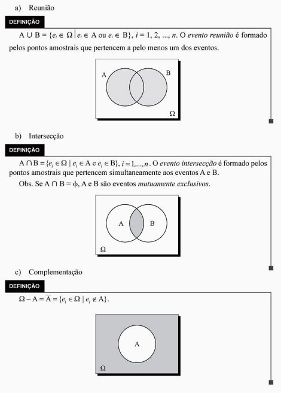

```{r setup, include=FALSE}
knitr::opts_chunk$set(echo = TRUE)
```

# - Objetivo:

Descrever sobre teoria de conjuntos, exemplos e aplicações.

Diante do objetivo do relatório, apresentaremos nas próximas subseções os pontos a serem discutidos:

- Experimento aleatório;

- Conjunto;

- Espaço amostral;

- Evento;

- Operações com conjuntos;

- Probabilidade;

- Breve Conclusão.

# - Teoria de conjuntos:

## -  Experimento Aleatório;

A cada experimento aleatório está associado o resultado obtido, que não é previsível, chamado evento aleatório.

Exemplos:

a) lançamento de uma moeda honesta; 

b) lançamento de um dado; 

No exemplo a os eventos associados são cara (C) e coroa (K); 

No exemplo b poderá ocorrer uma das faces 1, 2, 3, 4, 5 ou 6.


## - População ou conjunto:

População: é o conjunto formado por indivíduos ou objetos que têm pelo menos uma 
variável comum e observável. Podemos falar em: 

• população dos alunos do primeiro período de uma faculdade; 

• população dos operários da indústria automobilística; 

• população de alturas em cm das pessoas de determinado bairro; 

• população de peças fabricadas numa linha de produção, e assim por diante.

## - Espaço Amostral

Espaço amostral de um experimento aleatório é o conjunto dos resultados do experimento. Os elementos do espaço amostral serão chamados também de pontos amostrais. 
Representaremos o espaço amostral por Ω. 

Exemplos:

a) lançamento de uma moeda honesta; 

Ω = {C, k} 

b) lançamento de um dado;

Ω ={l, 2, 3, 4, 5, 6} 

c) lançamento de duas moedas; 

Ω ={(C, C), (C, K), (K, C), (K, K)} 

d) determinação da vida útil de um componente eletrônico. 

Ω = {t ∈ IR; t ≥ O} 

e) Detenninação do espaço an1ostral: podemos determiná-lo por uma tabela de dupla 
entrada (produto ca1tesiano ). 


## - Evento

O evento aleatório pode ser um único ponto amostral ou uma reunião deles, como 
veremos no exemplo a seguir: 

Lançam - se dois dados. Enumerar os seguintes eventos: 

A: saída de faces iguais; 

B: saída de faces cuja soma seja igual a 10; 

C: saída de faces cuja son1a seja menor que 2;

D: saída de faces cuja soma seja menor que 15; 

E: saída de faces onde uma face é o dobro da outra. 

Os eventos pedidos são: 

A = {(1, 1), (2, 2), (3, 3), (4, 4), (5, 5), (6, 6)} 

B = {(4, 6), (5, 5), (6, 4)} 

C = ∅ (evento impossível) 

D = Ω (evento certo) 

E= {(l, 2), (2, 1), (2, 4), (3, 6), (4, 2), (6, 3)}

Uma outra maneira de determinar o espaço amostral desse experimento é usar o 
diagrama ern árvore:


## - Operações

Sejam A e B dois eventos de F(Ω). 
As seguintes operações são definidas: 




# - Probabilidade:

## - Definição

É a função P que associa a cada evento de F um número real pertencente ao intervalo [O, 1], satisfazendo os axiomas:

I) \( P(\Omega) = 1 \)

\vspace{0.3cm}

II) \( P(A \cup B) = P(A) + P(B) \), se \( A \) e \( B \) forem mutuamente exclusivos.

\vspace{0.3cm}

III) \( P\left( \bigcup_{i=1}^{n} A_i \right) = \sum_{i=1}^{n} P(A_i) \), se \( A_1, A_2, \dots, A_n \) forem, dois a dois, eventos mutuamente exclusivos.

\vspace{0.3cm}

Observamos pela definição que \( 0 \leq P(A) \leq 1 \) para todo evento \( A \), \( A \subseteq \Omega \).


Apartir daqui vamos dar enfase aos exemplos:

## - Probabilidade condicional 

Introduziremos a noção de probabilidade condicional através do seguinte exemplo: 

Exemplo 1

Consideremos 250 alunos que cursam o primeiro ciclo de uma faculdade. Destes 
alunos, 100 são homens (H) e 150 são mulheres (1\1); 11 O cursam física (F) e 140 cursam quí1nica (Q). A distribuição dos alunos é a seguinte: 

\textbf{Pergunta:} Um aluno é sorteado ao acaso. Qual a probabilidade de que esteja cursando química, dado que é mulher?

\vspace{0.5cm}

Pelo quadro, vemos que essa probabilidade é de \( \frac{80}{150} \) e representamos:

\[
P(Q / M) = \frac{80}{150} \quad \text{(probabilidade de que o aluno curse química, condicionado ao fato de ser mulher).}
\]

Observamos, porém, que \( P(M \cap Q) = \frac{80}{250} \) e \( P(M) = \frac{150}{250} \). Para obtermos o resultado do problema, basta considerar que:

\[
P(Q / M) = \frac{80}{150} = \frac{250}{150} \cdot \frac{80}{250}
\]

Logo:

\[
P(Q / M) = \frac{P(M \cap Q)}{P(M)}
\]

Sejam \( A \subseteq \Omega \) e \( B \subseteq \Omega \). Definimos a \textbf{probabilidade condicional de \( A \), dado que \( B \) ocorre} \( (A / B) \) como segue:

\[
P(A / B) = \frac{P(A \cap B)}{P(B)}, \quad \text{se } P(B) \neq 0
\]

Também:

\[
P(B / A) = \frac{P(B \cap A)}{P(A)}, \quad \text{se } P(A) \neq 0
\]

## - Teorema de Bayes 

### - Teorema da probabilidade total 

Sejam \( A_1, A_2, \dots, A_n \) eventos que formam uma partição do espaço amostral. Seja \( B \) um evento desse espaço. Então, temos:

\[
P(B) = \sum_{i=1}^{n} P(A_i) \cdot P(B \mid A_i)
\]


Exemplo 2

Uma urna contém 3 bolas brancas e 2 amarelas. Uma segunda urna contém 4 bolas brancas e 2 amarelas. Escolhe-se, ao acaso, uma urna e dela retira-se, também ao acaso, uma bola. Qual a probabilidade de que seja branca?

Resolução:

A bola branca pode ocorrer: $ B = (B | I) \cup (B | II) $


P(B) = P(B | I) + P(B | II)


$$
P(B) = P(I) \cdot P(B | I) + P(II) \cdot P(B | II)
$$

Calculando,

$$
P(B | I) = \frac{3}{5}, \quad P(B | II) = \frac{4}{6}
$$

Portanto,

$$
P(B) = \frac{1}{2} \cdot \frac{3}{5} + \frac{1}{2} \cdot \frac{4}{6}
$$

\section{Teorema de Bayes}
Sejam  A_1, A_2, \ldots, A_n  eventos que formam uma partição do espaço. Seja  B  um evento. Sejam conhecidas  P(A_i)  e  P(B | A_i) , para  i = 1, 2, \ldots, n . Então:

$$
P(A_i | B) = \frac{P(A_i) \cdot P(B | A_i)}{\sum_{j=1}^{n} P(A_j) \cdot P(B | A_j)}.
$$

### - O teorema de Bayes 

É também chamado de teorema da probabilidade a posteriori. Ele relaciona uma das parcelas da probabilidade total com a própria probabilidade total.

Exemplo 3 

A urna A contém 3 fichas vermelhas e 2 azuis, e a urna B contém 2 vermelhas e 8 azuis. Joga-se uma moeda "honesta". Se a moeda der cara, extrai-se uma ficha da urna A; se der coroa, extrai-se uma ficha da urna B. Uma ficha vermelha é extraída. Qual a probabilidade de ter saído cara no lançamento?

Resolução:

Queremos: P(C | V) 

Utilizando a fórmula da probabilidade total:

$$
P(V) = P(C) \cdot P(V | C) + P(K) \cdot P(V | K).
$$

Calculando,

$$
P(V) = \frac{1}{2} \cdot \frac{3}{5} + \frac{1}{2} \cdot \frac{2}{10} = \frac{3}{10} + \frac{1}{10} = \frac{4}{10}.
$$

Agora, calculamos  P(C | V) :

$$
P(C | V) = \frac{P(V | C) \cdot P(C)}{P(V)}.
$$


Responda as seguintes questões a seguir, relacionadas a probabilidade:

Exemplo 4:

- Sabe-se que cada uma das pessoas A, B, C e D, falam a verdade uma dado instante com probabilidade de 1/3. Suponha que A faça uma afirmação, e D disse que C, que disse que B, que disse que A estava falando a verdade. Qual a probabilidade de que A tenha falado a verdade?

Resolução

Tudo começa com a pessoa D dizendo que as pessoas C, B e A falaram a verdade. Portanto, vamos calcular a probabilidade condicional de que a pessoa A falou a verdade na certeza que D disse a verdade, assim:

\[
P(A|D) = \frac{P(A \cap D)}{P(D)} 
\]
onde:

(1)
\[
P(A \cap  D) =  \frac{1}{81} + \frac{4}{81}  + \frac{4}{81}  + \frac{4}{81}  = \frac{13}{81}
\]

(2)

\[
P(D) =  \frac{1}{81}  +  6\cdot  \frac{4}{81}  + \frac{16}{81}  = \frac{41}{81} 
\]

(Faça o diagrama de árvore, para simplificar o entendimento)

As probabilidades (1) e (2) são encontradas pelo diagrama de árvore, daí:

\vspace{0.4cm}
\sc{\includegraphics[scale=0.1]{Figura/ma41a.jpeg} } 

\[
P(A\cap D) =  \frac{13}{81}   \cdot  \frac{81}{41}  = \frac{13}{41}  \approx 31,7\% 
\]

Exemplo 5:

- Em um experimento de reprodução, sabe-se que o progenitor masculino possui dois genes dominantes (simbolizado por AA) ou um dominante e um recessivo (Aa). Esses dois casos são igualmente prováveis. O progenitor feminino é conhecido por dois genes recessivos (aa). Como a prole recebe um de cada progenitor, será Aa ou aa, e será possível dizer com certeza qual deles.

a) Suponha que um dos descendentes seja Aa, qual é a probabilidade de que o progenitor masculino seja AA?

b) Suponha que dois descendentes sejam ambos Aa, qual é a probabilidade de que o progenitor masculino seja AA?

c) Se uma prole é aa, qual a probabilidade de que o progenitor masculino seja Aa?

Resolução

Queremos encontrar a probabilidade condicional de que o progenitor seja AA dado que o descendente seja Aa.


Teorema de Bayes

\[
P(\text{AA}|\text{Aa}) = \frac{P(\text{Aa}|\text{AA}) \cdot P(\text{AA})}{P(\text{Aa})}
\]


Como o progenitor é AA ou Aa. Assim, temos que:

\[
P(\text{AA}) = P(\text{Aa}) = \frac{1}{2}
\]

Agora, podemos calcular \(P(\text{Aa})\) da seguinte forma:

\[
P(\text{Aa}) = P(\text{Aa}|\text{AA}) \cdot P(\text{AA}) + P(\text{Aa}|\text{Aa}) \cdot P(\text{Aa})
\]

onde:

\[
P(\text{Aa}|\text{AA}) = 1 \quad \text{e} \quad P(\text{Aa}|\text{Aa}) = \frac{1}{2}
\]

Assim, temos:

\[
P(\text{Aa}) = \frac{1 \cdot 1}{2} + \frac{1 \cdot 1}{2} = \frac{3}{4}
\]

Dessa forma:

\[
P(\text{AA}|\text{Aa}) = \frac{\frac{2}{3}}{\frac{3}{4}} = \frac{2}{3}
\]

2.3) Dado que \( B = \bigcup_{j=1}^{n} B_j \), com \( B_1, B_2, \dots, B_n \) mutuamente disjuntos, e que \( P(A | B_j) = p \) para todo \( j = 1, 2, \dots, n \), vamos demonstrar que \( P(A | B) = p \).

Passo 1: Teorema da probabilidade total

Sabemos que:
\[
P(A | B) = \frac{P(A \cap B)}{P(B)}
\]
Onde \( B = \bigcup_{j=1}^{n} B_j \), ou seja, \( B \) é a união dos eventos mutuamente disjuntos \( B_1, B_2, \dots, B_n \). Logo, podemos escrever:
\[
P(A \cap B) = P\left( A \cap \bigcup_{j=1}^{n} B_j \right)
\]
Como os eventos \( B_j \) são mutuamente disjuntos, isso implica que:
\[
P(A \cap B) = \sum_{j=1}^{n} P(A \cap B_j)
\]

Passo 2: Aplicando a definição de probabilidade condicional

Sabemos que \( P(A \cap B_j) = P(A | B_j) \cdot P(B_j) \). Substituindo na equação anterior:
\[
P(A \cap B) = \sum_{j=1}^{n} P(A | B_j) \cdot P(B_j)
\]

Passo 3: Substituindo \( P(A | B_j) = p \)

Pelo enunciado, sabemos que \( P(A | B_j) = p \) para todo \( j \). Portanto, a equação fica:
\[
P(A \cap B) = \sum_{j=1}^{n} p \cdot P(B_j)
\]
Fatorando \( p \) da soma:
\[
P(A \cap B) = p \cdot \sum_{j=1}^{n} P(B_j)
\]

Passo 4: Usando a probabilidade total de \( B \)

Sabemos que \( \sum_{j=1}^{n} P(B_j) = P\left( \bigcup_{j=1}^{n} B_j \right) = P(B) \). Assim, temos:
\[
P(A \cap B) = p \cdot P(B)
\]

Passo 5: Substituindo na fórmula original de \( P(A | B) \)

Agora, podemos substituir \( P(A \cap B) = p \cdot P(B) \) na fórmula de \( P(A | B) \):
\[
P(A | B) = \frac{P(A \cap B)}{P(B)} = \frac{p \cdot P(B)}{P(B)} = p
\]

Portanto, mostramos que \( P(A | B) = p \).

 


# - Referências Bibliográficas:

Morettin, Luiz Gonzaga 
Estatística básica : probabilidade e inferência, 
volume único I Luiz Gonzaga Morettin. -- São Paulo : 
Pearson Prentice Hall, 201 O.


