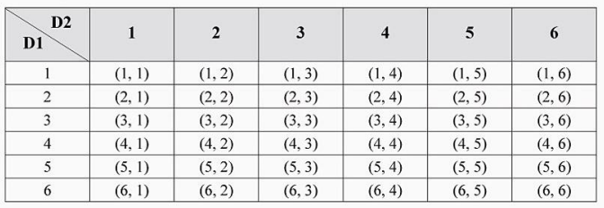
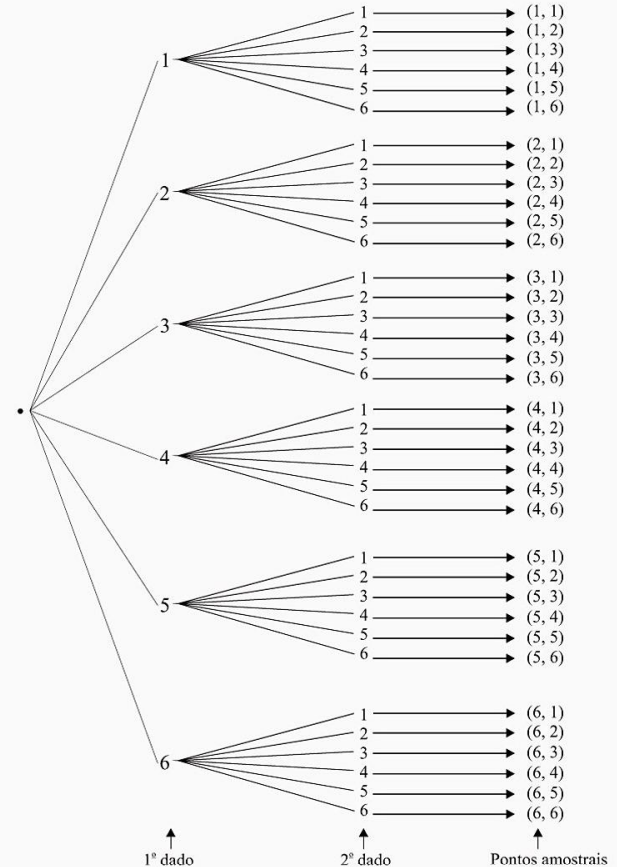
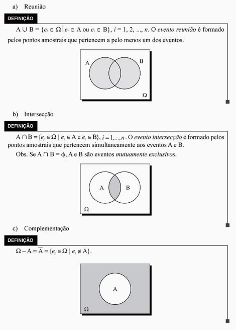

```{r setup, include=FALSE}
knitr::opts_chunk$set(echo = TRUE)
```


EM CONSTRUÇÃO


Estatística Básica: Probabilidade e Inferência

Luiz Gonzaga Morettin


Introdução à Estatística

A Estatística é a ciência que coleta, organiza, analisa e interpreta dados para auxiliar na tomada de decisões. Ao longo do tempo, a estatística tem desempenhado um papel essencial em várias áreas, como ciência, economia, saúde e políticas públicas.

Exemplo de Coleta de Dados
Um exemplo clássico de coleta de dados estatísticos é o censo, onde uma amostra da população é estudada para obter informações demográficas.

Conceitos Fundamentais
A probabilidade é um conceito fundamental na estatística. A definição clássica de probabilidade é baseada no número de resultados favoráveis dividido pelo número total de resultados possíveis.

Probabilidade Condicional

A probabilidade condicional de um evento $A$ dado que o evento $B$ ocorreu é calculada como:

\[
P(A|B) = \frac{P(A \cap B)}{P(B)}, \quad P(B) > 0
\]

Inferência Estatística

A inferência estatística envolve o uso de dados de amostra para fazer inferências sobre uma população. Existem dois tipos principais de inferência: estimativa e teste de hipóteses.

Estimativa

A estimativa envolve o uso de dados amostrais para calcular estimativas pontuais ou intervalares de parâmetros populacionais. Por exemplo, a média amostral é uma estimativa pontual da média populacional.

Teste de Hipóteses

O teste de hipóteses é uma metodologia para tomar decisões baseadas em dados amostrais. Um teste de hipóteses típico envolve a formulação de uma hipótese nula ($H_0$) e uma hipótese alternativa ($H_1$), e o cálculo de um valor $p$ para determinar se $H_0$ deve ser rejeitada.


Capítulo 4: Variáveis Aleatórias e Distribuições de Probabilidade
Uma variável aleatória é uma função que associa um número real a cada resultado de um experimento aleatório. As variáveis aleatórias podem ser classificadas em dois tipos: discretas e contínuas.

Distribuição de Probabilidade

A distribuição de probabilidade de uma variável aleatória descreve a probabilidade de que ela assuma cada um de seus possíveis valores. Para uma variável aleatória discreta $X$, a função de probabilidade é dada por:

\[
P(X = x_i) = p_i, \quad \sum_i p_i = 1
\]

Já para uma variável aleatória contínua, a função densidade de probabilidade é tal que:

\[
P(a \leq X \leq b) = \int_a^b f_X(x) dx
\]

Capítulo 5: Distribuição Binomial

A distribuição binomial descreve o número de sucessos em uma sequência de experimentos independentes de Bernoulli. A probabilidade de obter exatamente $k$ sucessos em $n$ tentativas é dada pela fórmula:

\[
P(X = k) = \binom{n}{k} p^k (1-p)^{n-k}
\]
onde $p$ é a probabilidade de sucesso em cada tentativa.


Suponha que estamos jogando uma moeda 10 vezes e que a probabilidade de obter cara em cada jogada seja 0,5. A probabilidade de obter exatamente 6 caras é:

\[
P(X = 6) = \binom{10}{6} 0,5^6 (1-0,5)^{4}
\]

Distribuição Normal

A distribuição normal, também conhecida como distribuição Gaussiana, é uma das distribuições mais importantes na estatística. A função densidade de probabilidade da distribuição normal é dada por:

\[
f(x) = \frac{1}{\sigma \sqrt{2\pi}} \exp \left( -\frac{(x - \mu)^2}{2\sigma^2} \right)
\]

onde $\mu$ é a média e $\sigma^2$ é a variância.

Propriedades da Distribuição Normal

- A distribuição normal é simétrica em torno de sua média $\mu$.
- A variância $\sigma^2$ controla a dispersão da distribuição.
- Aproximadamente 68\% dos valores estão dentro de um desvio-padrão da média, e 95\% estão dentro de dois desvios-padrão.

Intervalos de Confiança

Um intervalo de confiança fornece uma estimativa para um parâmetro populacional com um grau de confiança especificado. O intervalo de confiança para a média populacional $\mu$, com variância conhecida $\sigma^2$, é dado por:

\[
\left( \bar{x} - z_{\alpha/2} \frac{\sigma}{\sqrt{n}}, \bar{x} + z_{\alpha/2} \frac{\sigma}{\sqrt{n}} \right)
\]

onde $\bar{x}$ é a média amostral, $n$ é o tamanho da amostra, e $z_{\alpha/2}$ é o valor crítico da distribuição normal padrão correspondente ao nível de confiança $\alpha$.

Teste de Hipóteses

No teste de hipóteses, formulamos uma hipótese nula $H_0$ e uma hipótese alternativa $H_1$, e usamos dados amostrais para decidir se devemos rejeitar $H_0$. O processo envolve a escolha de uma estatística de teste, a definição de uma região crítica e o cálculo de um valor $p$.

Erro Tipo I e Tipo II

- O erro tipo I ocorre quando rejeitamos a hipótese nula $H_0$ quando ela é verdadeira.
- O erro tipo II ocorre quando não rejeitamos $H_0$ quando ela é falsa.
A probabilidade de erro tipo I é chamada de nível de significância, geralmente denotada por $\alpha$.

 Regressão Linear
 
A regressão linear é uma técnica utilizada para modelar a relação entre uma variável dependente $Y$ e uma ou mais variáveis independentes $X$. O modelo de regressão linear simples é dado por:

\[
Y = \beta_0 + \beta_1 X + \epsilon
\]

onde $\beta_0$ é o intercepto, $\beta_1$ é o coeficiente de regressão e $\epsilon$ é o termo de erro.

Método dos Mínimos Quadrados

O método dos mínimos quadrados é utilizado para estimar os parâmetros $\beta_0$ e $\beta_1$ minimizando a soma dos quadrados dos resíduos:

\[
S(\beta_0, \beta_1) = \sum_{i=1}^{n} (y_i - \beta_0 - \beta_1 x_i)^2
\]


# - Objetivo:

Descrever sobre teoria de conjuntos, exemplos e aplicações.

Diante do objetivo do relatório, apresentaremos nas próximas subseções os pontos a serem discutidos:

- Experimento aleatório;

- Conjunto;

- Espaço amostral;

- Evento;

- Operações com conjuntos;

- Probabilidade;

- Breve Conclusão.

# - Teoria de conjuntos:

## -  Experimento Aleatório;

A cada experimento aleatório está associado o resultado obtido, que não é previsível, chamado evento aleatório.

Exemplos:

a) lançamento de uma moeda honesta; 

b) lançamento de um dado; 

No exemplo a os eventos associados são cara (C) e coroa (K); 

No exemplo b poderá ocorrer uma das faces 1, 2, 3, 4, 5 ou 6.


## - População ou conjunto:

População: é o conjunto formado por indivíduos ou objetos que têm pelo menos uma 
variável comum e observável. Podemos falar em: 

• população dos alunos do primeiro período de uma faculdade; 

• população dos operários da indústria automobilística; 

• população de alturas em cm das pessoas de determinado bairro; 

• população de peças fabricadas numa linha de produção, e assim por diante.

## - Espaço Amostral

Espaço amostral de um experimento aleatório é o conjunto dos resultados do experimento. Os elementos do espaço amostral serão chamados também de pontos amostrais. 
Representaremos o espaço amostral por Ω. 

Exemplos:

a) lançamento de uma moeda honesta; 

Ω = {C, k} 

b) lançamento de um dado;

Ω ={l, 2, 3, 4, 5, 6} 

c) lançamento de duas moedas; 

Ω ={(C, C), (C, K), (K, C), (K, K)} 

d) determinação da vida útil de um componente eletrônico. 

Ω = {t ∈ IR; t ≥ O} 

e) Detenninação do espaço an1ostral: podemos determiná-lo por uma tabela de dupla 
entrada (produto ca1tesiano ). 




## - Evento

O evento aleatório pode ser um único ponto amostral ou uma reunião deles, como 
veremos no exemplo a seguir: 

Lançam - se dois dados. Enumerar os seguintes eventos: 

A: saída de faces iguais; 

B: saída de faces cuja soma seja igual a 10; 

C: saída de faces cuja son1a seja menor que 2;

D: saída de faces cuja soma seja menor que 15; 

E: saída de faces onde uma face é o dobro da outra. 

Os eventos pedidos são: 

A = {(1, 1), (2, 2), (3, 3), (4, 4), (5, 5), (6, 6)} 

B = {(4, 6), (5, 5), (6, 4)} 

C = ∅ (evento impossível) 

D = Ω (evento certo) 

E= {(l, 2), (2, 1), (2, 4), (3, 6), (4, 2), (6, 3)}

Uma outra maneira de determinar o espaço amostral desse experimento é usar o 
diagrama ern árvore:




## - Operações

Sejam A e B dois eventos de F(Ω). 
As seguintes operações são definidas: 




# - Probabilidade:

EM CONSTRUÇÃO

# - Referências Bibliográficas:

Morettin, Luiz Gonzaga 
Estatística básica : probabilidade e inferência, 
volume único I Luiz Gonzaga Morettin. -- São Paulo : 
Pearson Prentice Hall, 201 O.

$ git add .
$ git commit -m "Comentário a ser inserido!"
$ git push


