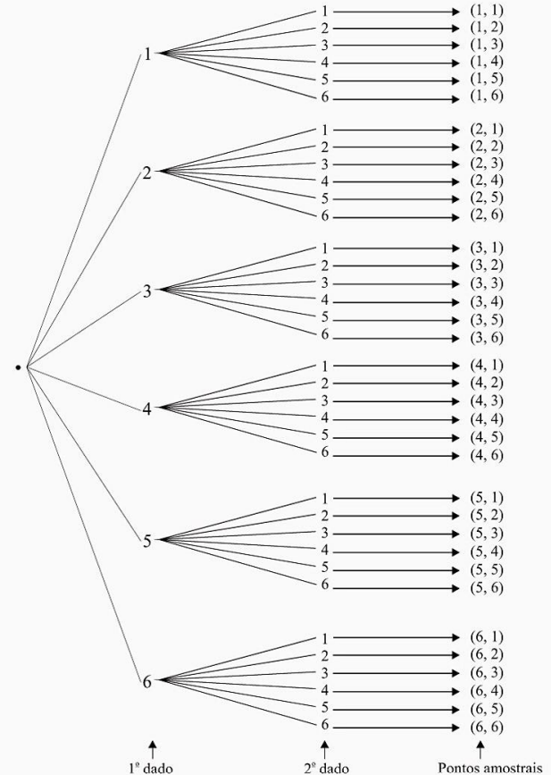

```{r setup, include=FALSE}
knitr::opts_chunk$set(echo = TRUE)
```

# - Objetivo:

Descrever sobre teoria de conjuntos, exemplos e aplicações.

Diante do objetivo do relatório, apresentaremos nas próximas subseções os pontos a serem discutidos:

- Experimento aleatório;

- Conjunto;

- Espaço amostral;

- Evento;

- Operações com conjuntos;

- Probabilidade;

- Breve Conclusão.

# - Teoria de conjuntos:

## -  Experimento Aleatório;

A cada experimento aleatório está associado o resultado obtido, que não é previsível, chamado evento aleatório.

Exemplos:

a) lançamento de uma moeda honesta; 

b) lançamento de um dado; 

No exemplo a os eventos associados são cara (C) e coroa (K); 

No exemplo b poderá ocorrer uma das faces 1, 2, 3, 4, 5 ou 6.


## - População ou conjunto:

População: é o conjunto formado por indivíduos ou objetos que têm pelo menos uma 
variável comum e observável. Podemos falar em: 

• população dos alunos do primeiro período de uma faculdade; 

• população dos operários da indústria automobilística; 

• população de alturas em cm das pessoas de determinado bairro; 

• população de peças fabricadas numa linha de produção, e assim por diante.

## - Espaço Amostral

Espaço amostral de um experimento aleatório é o conjunto dos resultados do experimento. Os elementos do espaço amostral serão chamados também de pontos amostrais. 
Representaremos o espaço amostral por Ω. 

Exemplos:

a) lançamento de uma moeda honesta; 

Ω = {C, k} 

b) lançamento de um dado;

Ω ={l, 2, 3, 4, 5, 6} 

c) lançamento de duas moedas; 

Ω ={(C, C), (C, K), (K, C), (K, K)} 

d) determinação da vida útil de um componente eletrônico. 

Ω = {t ∈ IR; t ≥ O} 

e) Detenninação do espaço an1ostral: podemos determiná-lo por uma tabela de dupla 
entrada (produto ca1tesiano ). 


## - Evento

O evento aleatório pode ser um único ponto amostral ou uma reunião deles, como 
veremos no exemplo a seguir: 

Lançam - se dois dados. Enumerar os seguintes eventos: 

A: saída de faces iguais; 

B: saída de faces cuja soma seja igual a 10; 

C: saída de faces cuja son1a seja menor que 2;

D: saída de faces cuja soma seja menor que 15; 

E: saída de faces onde uma face é o dobro da outra. 

Os eventos pedidos são: 

A = {(1, 1), (2, 2), (3, 3), (4, 4), (5, 5), (6, 6)} 

B = {(4, 6), (5, 5), (6, 4)} 

C = ∅ (evento impossível) 

D = Ω (evento certo) 

E= {(l, 2), (2, 1), (2, 4), (3, 6), (4, 2), (6, 3)}

Uma outra maneira de determinar o espaço amostral desse experimento é usar o 
diagrama ern árvore:




## - Operações

Sejam A e B dois eventos de F(Ω). 
As seguintes operações são definidas: 


# - Probabilidade:

EM CONSTRUÇÃO

# - Referências Bibliográficas:

Morettin, Luiz Gonzaga 
Estatística básica : probabilidade e inferência, 
volume único I Luiz Gonzaga Morettin. -- São Paulo : 
Pearson Prentice Hall, 201 O.


