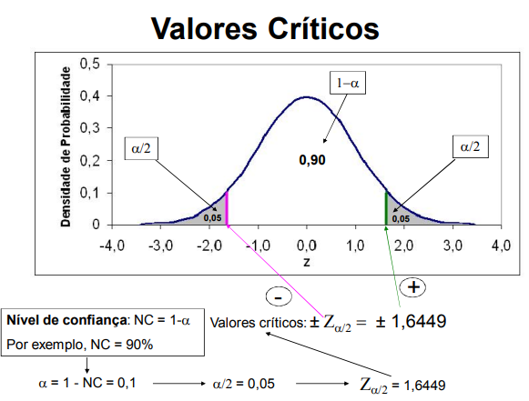

```{r setup, include=FALSE}
knitr::opts_chunk$set(echo = TRUE)
```

# - Objetivo:

Descrever sobre estimador intervalar.

Diante do objetivo do relatório, que será elaborado por 4 integrantes em arquivos distintos (minha parte é a Heterocedascidade), apresentaremos nas próximas subseções os pontos a serem discutidos:

- Estimador Intervalar;

- O método da Quantidade Pivótal (QP);

- Definir uma QP para Heterocedasticidade;

- Apresentar a distribuição da QP;

- Pivotar a QP;

- Apresentar o intervalo de confiança;

- Apresentar o IC para o conjunto de dados;

- Apresentar os resultados analiticamente usando R.


# - Estimador Intervalar:

Um intervalo de confiança (estimativa intervalar)
é uma amplitude de valores que tem probabilidade
de conter o verdadeiro valor da população. Este intervalo de confiança está associado a um grau de confiança que é uma medida de nossa
certeza de que o intervalo contém o parâmetro
populacional. É a probabilidade 1 - α.
A construção do intervalo para μ é baseada na
distribuição amostral da média amostral e no
grau de confiança.
É necessário que a suposição de normalidade para
os dados seja adequada.

Exemplo de uma estimativa intervalar:

A estimativa do Intervalo de Confiança (IC) de 95% para a proporção populacional p é 0,381 < p < 0,497.

**Interpretação**: Há uma interpretação correta e muitas erradas,
diferentes e criativas para o IC.

**Correta**: Estamos 95% confiantes de que o intervalo de 0,381
a 0,497 realmente contém o verdadeiro valor de p.

**Errada**: Há uma chance de 95% de que o verdadeiro valor de p
esteja entre 0,381 e 0,497.

Para estabelecer um IC são utilizados valores críticos.

**O uso do escore padrão Z**

O escore padrão Z pode ser usado para de distinguir entre
estatísticas amostrais que têm chance de ocorrer e aquelas
que não têm.

Sob certas condições a distribuição amostral das proporções
amostrais pode ser aproximada por uma distribuição normal.
Há uma probabilidade 1 - α de que uma proporção amostral
caia numa região limitada por dois valores de Z, para os quais
uma área de α/2 seja definida na cauda esquerda e uma área
de α/2 seja definida na cauda direita.

**Valores críticos**

Um valor crítico é um número na fronteira que separa
estatísticas amostrais que têm uma chance de ocorrer
daquelas que não têm.
O número Zα/2 é um valor crítico, que é um escore Z com
a propriedade de separar uma área de α /2 na cauda direita
da distribuição normal padronizada.

Vamos considerar um exemplo onde temos um intervalo
de confiança de 90%, ou seja, (1-α)=0,90



## -  Intervalo para média com variância desconhecida;

Considere uma amostra X1, . . . , Xn
vinda de uma população normal com média µ e variância σ^2.
Os valores µ e σ^2 são desconhecidos.
Sejam x̄ e s a média e desvio padrão observados para essa
amostra. 
A cada experimento aleatório está associado o resultado obtido, que não é previsível, chamado evento aleatório.


# - O método da Quantidade Pivótal (QP);

No método do PIVOT, a variável aleatória V é denominada quantidade pivotal ou pivot. A quantidade pivotal deve ter uma distribuição normal padrão ou uma distribuição T com n-1 graus de liberdade. 

O IC é uma medida de imprecisão do verdadeiro tamanho do efeito na população de interesse. A fórmula para calcular o IC é IC = x̄ ± z * (s / √n), onde:

- x̄ é a média amostral;

- z é o valor crítico que define o nível de confiança;

- s é o desvio padrão amostral;

- n é o tamanho da amostra;

O IC de 95% é o mais utilizado na área da saúde. Ele representa um intervalo numérico do qual, com 95% de confiança, o verdadeiro valor da população não pode ser afastado. 

O cálculo do IC é importante para preparar ações concretas com base em números mais assertivos. Ele permite estimar o tamanho real do resultado, pois decifra a margem de incerteza em relação a um cálculo realizado.

# - Heterocedasticidade:

**O que é Heterocedasticidade**

A heterocedasticidade é um conceito fundamental na análise de regressão e estatística, que se refere à situação em que a variância dos erros de um modelo de regressão não é constante ao longo de todas as observações. Em um modelo de regressão linear clássico, assume-se que os erros são homocedásticos, ou seja, que a variância dos erros é a mesma para todos os valores preditores. Quando essa suposição é violada, ocorre a heterocedasticidade, o que pode levar a inferências estatísticas incorretas e a uma interpretação errônea dos resultados.

**Causas da Heterocedasticidade**

Existem várias causas que podem levar à heterocedasticidade em um conjunto de dados. Uma das causas mais comuns é a presença de variáveis omitidas que influenciam a variável dependente. Quando essas variáveis não são incluídas no modelo, a variabilidade dos erros pode aumentar ou diminuir em diferentes níveis da variável preditora. Além disso, a heterocedasticidade pode surgir devido a transformações inadequadas dos dados, como a não linearidade nas relações entre variáveis. Outro fator que pode contribuir para a heterocedasticidade é a presença de outliers, que podem distorcer a variância dos erros.

**Identificação da Heterocedasticidade**

A identificação da heterocedasticidade é um passo crucial na análise de regressão. Existem várias técnicas e testes estatísticos que podem ser utilizados para detectar a presença de heterocedasticidade. Um dos métodos mais comuns é o gráfico de dispersão dos resíduos, onde os resíduos do modelo são plotados em relação aos valores preditores. Se a variância dos resíduos não é constante e apresenta um padrão, isso pode indicar heterocedasticidade. Além disso, testes formais, como o teste de Breusch-Pagan e o teste de White, podem ser aplicados para verificar a presença de heterocedasticidade de maneira mais rigorosa.

**Efeitos da Heterocedasticidade**

A heterocedasticidade pode ter efeitos significativos sobre a qualidade das estimativas de um modelo de regressão. Quando a variância dos erros não é constante, as estimativas dos coeficientes podem ser ineficientes, resultando em intervalos de confiança e testes de hipóteses que não são válidos. Isso significa que, mesmo que os coeficientes sejam não viesados, eles não são os melhores estimadores possíveis, o que pode levar a conclusões errôneas sobre a relação entre as variáveis. Portanto, é essencial abordar a heterocedasticidade para garantir a robustez das análises.


# - Método da Quantidade Pivótal (QP);

## - Definição de uma Quantidade Pivotal


A quantidade pivotal é uma função das amostras e dos parâmetros de interesse que possui uma distribuição conhecida, independentemente dos parâmetros desconhecidos. Para o problema de heterocedasticidade com variâncias desconhecidas, considere duas populações \(X_1, X_2, \dots, X_{n_1}\) e \(Y_1, Y_2, \dots, Y_{n_2}\), com:
\[
X_i \sim N(\mu_X, \sigma_X^2), \quad Y_j \sim N(\mu_Y, \sigma_Y^2),
\]
onde \( \sigma_X^2 \neq \sigma_Y^2 \) (heterocedasticidade) e ambos \( \mu_X \) e \( \mu_Y \) são desconhecidos.

A quantidade pivotal pode ser construída utilizando as estatísticas:
\[
T = \frac{\bar{X} - \bar{Y} - (\mu_X - \mu_Y)}{\sqrt{\frac{S_X^2}{n_1} + \frac{S_Y^2}{n_2}}},
\]
onde \( S_X^2 \) e \( S_Y^2 \) são as variâncias amostrais, calculadas como:
\[
S_X^2 = \frac{1}{n_1 - 1} \sum_{i=1}^{n_1} (X_i - \bar{X})^2, \quad S_Y^2 = \frac{1}{n_2 - 1} \sum_{j=1}^{n_2} (Y_j - \bar{Y})^2.
\]


## - Distribuição da Quantidade Pivotal

A distribuição da quantidade pivotal \( T \) é derivada a partir do fato de que, sob a hipótese nula \( (\mu_X - \mu_Y = \Delta_0) \), a quantidade:
\[
T = \frac{(\bar{X} - \bar{Y}) - \Delta_0}{\sqrt{\frac{S_X^2}{n_1} + \frac{S_Y^2}{n_2}}}
\]
segue aproximadamente uma distribuição \( t \) de Student com \( \nu \) graus de liberdade, onde os graus de liberdade são calculados pela fórmula:
\[
\nu = \frac{\left( \frac{S_X^2}{n_1} + \frac{S_Y^2}{n_2} \right)^2}{\frac{\left( \frac{S_X^2}{n_1} \right)^2}{n_1 - 1} + \frac{\left( \frac{S_Y^2}{n_2} \right)^2}{n_2 - 1}}.
\]

Essa distribuição é usada para determinar os valores críticos \( t_{1-\alpha/2, \nu} \) necessários para a construção de intervalos de confiança para \( \mu_X - \mu_Y \).
Em particular:

\item Quando \( T \) está dentro do intervalo \( [t_{1-\alpha/2, \nu}, t_{1-\alpha/2, \nu}] \), não rejeitamos a hipótese nula.
    \item Os valores críticos são obtidos a partir da tabela \( t \) de Student, dependendo do nível de confiança \( 1 - \alpha \) e dos graus de liberdade \( \nu \).


A combinação da definição e da distribuição da quantidade pivotal possibilita a construção de intervalos de confiança robustos, mesmo em cenários de heterocedasticidade, ou seja, quando as variâncias das populações são diferentes.


## - Pivotando a Quantidade Pivotal

A quantidade pivotal pode ser rearranjada para derivar os limites do intervalo de confiança para a diferença das médias \( \mu_X - \mu_Y \). Para um nível de confiança \( 1 - \alpha \), os quantis \( t_{\alpha/2, \nu} \) são usados para pivotar a equação:
\[
t_{\alpha/2, \nu} \leq \frac{\bar{X} - \bar{Y} - (\mu_X - \mu_Y)}{\sqrt{\frac{S_X^2}{n_1} + \frac{S_Y^2}{n_2}}} \leq t_{1 - \alpha/2, \nu}.
\]

Multiplicando todos os termos pelo denominador e rearranjando:
\[
\bar{X} - \bar{Y} - t_{1 - \alpha/2, \nu} \cdot \sqrt{\frac{S_X^2}{n_1} + \frac{S_Y^2}{n_2}} \leq \mu_X - \mu_Y \leq \bar{X} - \bar{Y} + t_{1 - \alpha/2, \nu} \cdot \sqrt{\frac{S_X^2}{n_1} + \frac{S_Y^2}{n_2}}.
\]

## - Apresentação do Intervalo de Confiança

O intervalo de confiança \( 1 - \alpha \) para \( \mu_X - \mu_Y \) é então dado por:
\[
IC = \left[ \left( \bar{X} - \bar{Y} \right) - t_{1 - \alpha/2, \nu} \cdot \sqrt{\frac{S_X^2}{n_1} + \frac{S_Y^2}{n_2}}, \quad \left( \bar{X} - \bar{Y} \right) + t_{1 - \alpha/2, \nu} \cdot \sqrt{\frac{S_X^2}{n_1} + \frac{S_Y^2}{n_2}} \right].
\]

Método Pivotal para Estimativa Intervalar em um Problema de Heterocedasticidade

**Dados do exemplo:**

Considere duas populações, representando notas de estudantes de duas escolas distintas, onde estamos comparando suas médias de notas em uma prova com variâncias diferentes e desconhecidas:


\item População 1 (Escola A):
\[
\bar{X} = 78, \quad S_X^2 = 64, \quad n_1 = 25.
\]
\item População 2 (Escola B):
\[
\bar{Y} = 72, \quad S_Y^2 = 100, \quad n_2 = 20.
\]
\item Nível de significância:
\[
\alpha = 0.05 \quad (\text{nível de confiança de } 95\%).
\]

Agora, vamos calcular o intervalo de confiança para a diferença de médias, \( \mu_X - \mu_Y \).

**Passo 1:** Determinar os Graus de Liberdade Aproximados (\( \nu \))

A fórmula para os graus de liberdade é dada por:
\[
\nu = \frac{\left( \frac{S_X^2}{n_1} + \frac{S_Y^2}{n_2} \right)^2}{\frac{\left( \frac{S_X^2}{n_1} \right)^2}{n_1 - 1} + \frac{\left( \frac{S_Y^2}{n_2} \right)^2}{n_2 - 1}}.
\]

**a) Cálculo dos componentes:**

\[
\frac{S_X^2}{n_1} = \frac{64}{25} = 2.56, \quad \frac{S_Y^2}{n_2} = \frac{100}{20} = 5.0.
\]

**b) Soma dos componentes:**

\[
\frac{S_X^2}{n_1} + \frac{S_Y^2}{n_2} = 2.56 + 5.0 = 7.56.
\]

**c) Quadrados das razões:**

\[
\frac{\left( \frac{S_X^2}{n_1} \right)^2}{n_1 - 1} = \frac{2.56^2}{24} = \frac{6.5536}{24} \approx 0.2731,
\]
\[
\frac{\left( \frac{S_Y^2}{n_2} \right)^2}{n_2 - 1} = \frac{5.0^2}{19} = \frac{25}{19} \approx 1.3158.
\]

**d) Soma dos quadrados:**

\[
0.2731 + 1.3158 = 1.5889.
\]

**e) Cálculo dos graus de liberdade:**

\[
\nu = \frac{(7.56)^2}{1.5889} \approx \frac{57.1536}{1.5889} \approx 36.0.
\]

**Passo 2:** Determinar o Valor Crítico \( t_{1-\alpha/2, \nu} \)

Para \( \alpha = 0.05 \) e \( \nu = 36 \), usamos a tabela \( t \) de Student. O valor crítico é aproximadamente:
\[
t_{1-\alpha/2, \nu} \approx 2.03.
\]

**Passo 3:** Calcular o Erro Padrão e os Limites do Intervalo de Confiança

**a) Erro padrão:**

\[
EP = \sqrt{\frac{S_X^2}{n_1} + \frac{S_Y^2}{n_2}} = \sqrt{2.56 + 5.0} = \sqrt{7.56} \approx 2.75.
\]

**b) Limites do intervalo:**

\[
\text{Limite inferior} = (\bar{X} - \bar{Y}) - t_{1-\alpha/2, \nu} \cdot EP,
\]
\[
\text{Limite superior} = (\bar{X} - \bar{Y}) + t_{1-\alpha/2, \nu} \cdot EP.
\]

**Substituindo os valores:**

\[
\bar{X} - \bar{Y} = 78 - 72 = 6,
\]
\[
\text{Limite inferior} = 6 - 2.03 \cdot 2.75 \approx 6 - 5.5825 \approx 0.42,
\]
\[
\text{Limite superior} = 6 + 2.03 \cdot 2.75 \approx 6 + 5.5825 \approx 11.58.
\]

**Passo 4: Intervalo de Confiança Final**

O intervalo de confiança para \( \mu_X - \mu_Y \) com 95\% de confiança é:
\[
IC = [0.42, 11.58].
\]


# - Referências Bibliográficas:

Morettin, Luiz Gonzaga 
Estatística básica : probabilidade e inferência, 
volume único I Luiz Gonzaga Morettin. -- São Paulo : 
Pearson Prentice Hall, 201 O.


